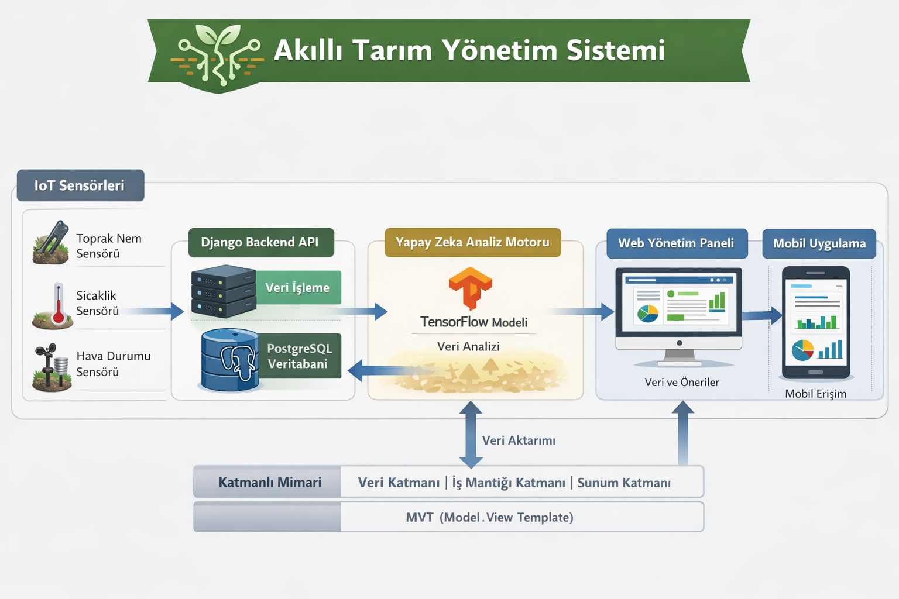

# 🌱 Akıllı Tarım Yönetim Sistemi

## 👥 Grup Üyeleri ve Görev Dağılımı
- **Ahmet Enes Altun** → Proje Mimari Tasarımı
- **Hayat Ay** → Proje Analizi ve Kapsam Belirleme  
- **Sami Yusuf Yıldız** → Gereksinim Toplama ve Analizi 
- **Ebubekir Yılmaz** → Teknoloji Araştırması ve Seçimi
- **Ceren Çam** → Geliştirme Ortamı Kurulumu

---

## 📌 Proje Açıklaması
Bu proje, sensör verileri ve yapay zeka kullanarak tarım süreçlerini optimize etmeyi amaçlamaktadır.  
Toprak nemi, sıcaklık ve hava durumu gibi veriler analiz edilerek sulama, gübreleme ve ilaçlama işlemleri daha verimli bir şekilde yönetilecektir.  

Sistem, tarım alanından toplanan verileri analiz ederek çiftçilere doğru kararlar almalarında yardımcı olur. Böylece hem verimlilik artırılır hem de su ve gübre gibi kaynakların gereksiz kullanımı azaltılır.

---

## 🛠️ Kullanılan Teknolojiler
- Python  
- TensorFlow  
- IoT Sensörleri  
- Django  
- PostgreSQL  

---

## 📦 Teslim Edilecek Modüller
- ✅ Sensör veri toplama modülü  
- ✅ Yapay zeka tabanlı analiz motoru  
- ✅ Web tabanlı yönetim paneli  
- ✅ Mobil uygulama  

---

🏗️ Proje Mimari Tasarımı (Ahmet Enes Altun)
📝 Genel Mimari

Akıllı Tarım Yönetim Sistemi, tarım alanına yerleştirilen IoT sensörlerinden veri toplayan, bu verileri analiz eden ve kullanıcıya web veya mobil uygulama üzerinden sunan bir sistemdir.

Sistem şu şekilde çalışır:

IoT sensörleri çevresel verileri toplar

Toplanan veriler backend API (Django) aracılığıyla sunucuya iletilir

Veriler PostgreSQL veritabanında saklanır

TensorFlow tabanlı yapay zeka modeli verileri analiz eder

Analiz sonuçları web paneli ve mobil uygulama üzerinden kullanıcıya sunulur

🔧 Sistem Modülleri

Sensör Veri Toplama Modülü

Veri İşleme ve Depolama Modülü

Yapay Zeka Analiz Modülü

Web Yönetim Paneli

Mobil Uygulama

🧩 Bileşenler Arasındaki İlişki

IoT Sensörleri → Django API → PostgreSQL Veritabanı → TensorFlow Analiz Motoru → Web Paneli / Mobil Uygulama

Sensörlerden gelen veriler backend tarafından alınır, veritabanında saklanır ve AI motoru ile analiz edilerek kullanıcılara öneriler ve otomatik kontrol sağlar.

🏛️ Kullanılan Tasarım Desenleri

Katmanlı Mimari (Layered Architecture): Veri katmanı, iş mantığı katmanı ve sunum katmanı olarak ayrılmıştır

MVT (Model-View-Template): Django frameworkü backend geliştirilmesinde bu mimari yapıyı kullanır. Model veri yapısını temsil eder, View iş mantığını yönetir ve Template kullanıcıya gösterilen arayüzü oluşturur.

📊 Mimari Diyagram

✅ Sonuç

Bu mimari yapı sayesinde sistem, sensörlerden gelen verileri analiz ederek tarım süreçlerini optimize eder. Modüler yapı sayesinde sistemin geliştirilmesi ve ileride genişletilmesi kolaydır.

# 🏗️ Teknoloji Araştırması ve Seçim Gerekçeleri (Ebubekir Yılmaz)

## 1. Programlama Dili: Python
Projenin ana geliştirme dili olarak **Python 3.10+** seçilmiştir.

* **Neden?** IoT cihazlarından veri çekme, TensorFlow ile yapay zeka modeli eğitme ve Django ile web sunucusu geliştirme süreçlerinin tamamını tek bir dil ekosisteminde birleştirerek ekip içi iş birliğini maksimize eder.
* **Gerekçe:** Geniş kütüphane desteği. Sensör verisi işleme için `Pandas`, karmaşık matematiksel hesaplamalar için `NumPy` gibi endüstri standardı araçlara sahiptir.

## 2. Backend Framework: Django & Django REST Framework (DRF)
Sistem mimarisinin web uygulama çatısı olarak **Django** tercih edilmiştir.

* **Neden?** "Pilleri dahil" (batteries-included) felsefesi sayesinde kullanıcı yönetimi, admin paneli ve veritabanı güvenliği hazır olarak sunulur. **DRF** ise mobil uygulama ve IoT cihazları için standartlara uygun bir API katmanı sağlar.
* **Gerekçe:** Veri güvenliği ve hızlı prototipleme yeteneği. Tarım verilerinin tutarlılığı için Django'nun gelişmiş ORM (Object-Relational Mapping) yapısı en güvenilir çözümdür.

## 3. Veritabanı: PostgreSQL (+ TimescaleDB)
Veri depolama birimi olarak ilişkisel veritabanı lideri **PostgreSQL** seçilmiştir.

* **Neden?** Çiftçi bilgileri ve tarla konumları gibi yapılandırılmış veriler için en sağlam açık kaynaklı çözümdür.
* **Gerekçe:** Tarım sensörlerinden gelen veriler "zaman serisi" (Time-series) niteliğindedir. **TimescaleDB** eklentisi ile milyonlarca satırlık veri üzerinde yüksek performanslı analizler yapılabilmektedir.

## 4. Yapay Zeka: TensorFlow & Keras
Analiz motoru ve karar destek mekanizması için **TensorFlow** kütüphanesi kullanılmaktadır.

* **Neden?** Derin öğrenme (Deep Learning) modelleri için dünya çapında standarttır.
* **Gerekçe:** Özellikle görüntü işleme (bitki hastalığı teşhisi) ve çok değişkenli hava durumu tahminleri için esnek ve güçlü bir altyapı sunar.

## 5. IoT İletişim Protokolü: MQTT (Mosquitto)
Sensör ve sunucu arasındaki haberleşme için **MQTT** protokolü belirlenmiştir.

* **Neden?** Standart HTTP protokolünün IoT cihazları için oluşturduğu yükü (overhead) ortadan kaldırır. Düşük enerji tüketimi için optimize edilmiştir.
* **Gerekçe:** Tarladaki sensörlerin pil ömrünü korur ve zayıf internet bağlantısı olan kırsal bölgelerde bile veri iletimini garanti eder.

---

## 📊 Özet Karşılaştırma Tablosu

| Bileşen | Seçilen Araç | En Büyük Avantajı |
| :--- | :--- | :--- |
| **Dil** | Python 3.10+ | Ekosistem birliği (AI + Web + Scripting) |
| **Veri Analizi** | Pandas / NumPy | Sensör verilerini temizleme ve işleme hızı |
| **Haberleşme** | MQTT / WebSockets | Gerçek zamanlı veri akışı ve düşük enerji tüketimi |
| **Deployment** | Docker | Ortam bağımsız, hızlı ve hatasız kurulum |

---

## Proje Kapsam Belgesi (Hayat Ay)
## 1. Proje Tanımı:
Akıllı Tarım Yönetim Sistemi, tarım alanlarından IoT sensörleri aracılığıyla toplanan verileri analiz ederek
çiftçilere daha verimli ve sürdürülebilir tarım yönetimi sunmayı amaçlayan bir yazılım sistemidir. Sistem,
çevresel verileri toplayarak analiz eder ve kullanıcıya web veya mobil arayüz üzerinden anlamlı bilgiler sağlar.
Toplanan veriler merkezi bir sistemde saklanır ve yapay zeka destekli analizler ile değerlendirilir. Böylece kullanıcılar tarım faaliyetlerini daha bilinçli ve verimli şekilde yönetebilir.

## 2. Projenin Amacı
Bu projenin amacı, tarım alanlarında kullanılan sensörlerden elde edilen verileri dijital ortamda analiz ederek çiftçilere karar destek sistemi sunmaktır.
## Projenin temel hedefleri şunlardır:
Tarımsal verilerin otomatik olarak toplanması
Verilerin güvenli şekilde saklanması
Yapay zeka algoritmaları ile analiz edilmesi
Kullanıcıların web veya mobil arayüz üzerinden verilere erişebilmesi
Tarımsal verimliliğin artırılması

## 3. Kullanılan Teknolojiler
## Projenin geliştirilmesinde aşağıdaki teknolojiler kullanılacaktır:
Python: Sistem geliştirme ve veri işleme süreçlerinde ana programlama dili olarak kullanılacaktır.
TensorFlow: Sensörlerden gelen verilerin analiz edilmesi ve tahmin modellerinin oluşturulması için kullanılacaktır.
IoT Sensörleri: Tarım alanından sıcaklık, nem ve diğer çevresel verileri toplamak için kullanılacaktır.
Django: Web tabanlı API ve yönetim panelinin geliştirilmesi için kullanılacaktır.
PostgreSQL: Sensör verilerinin güvenli ve düzenli şekilde saklanması için veritabanı sistemi olarak kullanılacaktır.

## 4. Proje Kapsamı
## Kapsama Dahil Olan Özellikler
IoT sensörlerinden veri toplanması
Sensör verilerinin API aracılığıyla sisteme gönderilmesi
Verilerin PostgreSQL veritabanında saklanması
Python ve TensorFlow kullanılarak veri analizi yapılması
Django tabanlı web arayüzü üzerinden verilerin görüntülenmesi
Kullanıcıların sisteme giriş yapabilmesi
Sistem yöneticisinin verileri yönetebilmesi

## Kapsama Dahil Olmayan Özellikler
Sensör donanımının fiziksel üretimi
Tarım makinelerinin otomatik kontrol edilmesi
Ticari ölçekli büyük tarım işletmeleri için özel modüller

## 5. Proje Paydaşları
Paydaş                     Açıklama
Çiftçiler	                 Sistemi kullanarak tarım verilerini takip eder
Sistem                     Yöneticisi	Sistemi yönetir ve kontrol eder
Yazılım Geliştiriciler	   Sistemin geliştirilmesini sağlar
Proje Ekibi               	Projenin planlanması ve uygulanmasından sorumludur

## 6. Sonuç
Akıllı Tarım Yönetim Sistemi, IoT sensörleri ve yapay zeka teknolojilerini bir araya getirerek tarım verilerinin daha verimli şekilde analiz edilmesini sağlamayı amaçlamaktadır. Bu sistem sayesinde çiftçiler çevresel verileri daha kolay takip edebilecek ve tarım süreçlerini daha verimli şekilde yönetebilecektir.

---

## Geliştirme Ortamı Kurulumu (Ceren Çam)

## Geliştirme Ortamı
Akıllı Tarım Yönetim Sistemi projesinin geliştirme sürecinde kullanılacak yazılım araçları ve bağımlılıklar belirlenmiş ve geliştirme ortamı yapılandırılmıştır. Bu ortam, ekip üyelerinin aynı teknolojileri kullanarak proje üzerinde çalışabilmesini sağlar.

## Kullanılan Geliştirme Araçları

## 1. IDE (Kod Geliştirme Ortamı)
Projenin geliştirilmesi için Visual Studio Code (VS Code) kullanılacaktır.
VS Code;
- Python geliştirme desteği sunar
- Git ile entegre çalışabilir
- Django projeleri için uygun bir geliştirme ortamı sağlar

## 2. Programlama Dili
Projenin geliştirilmesinde ana programlama dili olarak Python 3.10+ kullanılacaktır.
Python;
- sensör verilerinin işlenmesi
- yapay zeka modellerinin geliştirilmesi
- backend servislerinin oluşturulması
gibi işlemler için kullanılacaktır.

## 3. Backend Framework
Web tabanlı yönetim paneli ve API geliştirme süreçleri için Django frameworkü kullanılacaktır.
API geliştirme sürecinde ayrıca Django REST Framework (DRF) kullanılacaktır.

## 4. Yapay Zeka ve Veri Analizi Kütüphaneleri
Sensörlerden elde edilen verilerin analiz edilmesi için TensorFlow kullanılacaktır.
Veri işleme ve analiz süreçlerinde aşağıdaki Python kütüphaneleri kullanılacaktır:
- NumPy
- Pandas
Bu kütüphaneler sensör verilerinin işlenmesi ve analiz edilmesi için kullanılacaktır.

## 5. Veritabanı Sistemi
Projenin veri depolama sistemi olarak PostgreSQL veritabanı kullanılacaktır.
PostgreSQL;
- sensör verilerinin saklanması
- kullanıcı bilgilerinin tutulması
- analiz sonuçlarının depolanması
için kullanılacaktır.

## 6. IoT İletişim Protokolü
Tarım alanında bulunan sensörler ile sistem arasındaki veri iletişimi için MQTT protokolü kullanılacaktır.
MQTT;
- düşük enerji tüketimi
- hızlı veri iletimi
- IoT cihazları ile uyumlu yapı
gibi avantajlar sağlar.

## 7. Versiyon Kontrol Sistemi
Projenin kaynak kodlarının yönetilmesi için Git ve GitHub kullanılmaktadır.
Git;
- ekip üyelerinin aynı proje üzerinde birlikte çalışmasını sağlar
- yapılan değişikliklerin takip edilmesini sağlar
- proje sürümlerinin kontrol edilmesine yardımcı olur
Proje deposu GitHub üzerinde oluşturulmuş ve ekip üyeleri projeye dahil edilmiştir.

## 8. AI Destekli Geliştirme Araçları
Proje geliştirme sürecinde bazı modüllerin oluşturulması ve prototip geliştirme aşamalarında Antigravity AI aracı kullanılacaktır.
Antigravity;
- proje modüllerinin hızlı şekilde oluşturulması
- prototip geliştirme süreçlerinin hızlandırılması
- yazılım geliştirme sürecinin desteklenmesi
amacıyla kullanılmaktadır.

## Sonuç
Belirlenen geliştirme ortamı sayesinde ekip üyeleri aynı araçları kullanarak proje üzerinde çalışabilir. Bu ortam, yazılım geliştirme sürecinin düzenli ilerlemesini ve ekip içi iş birliğinin sağlanmasını kolaylaştırır.
