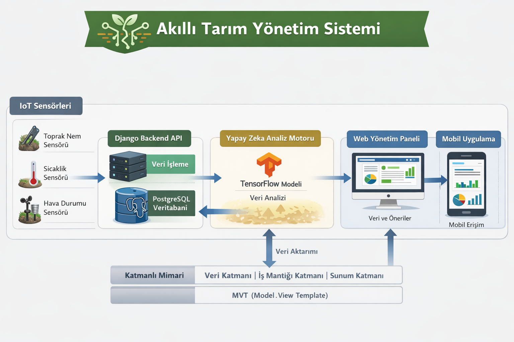
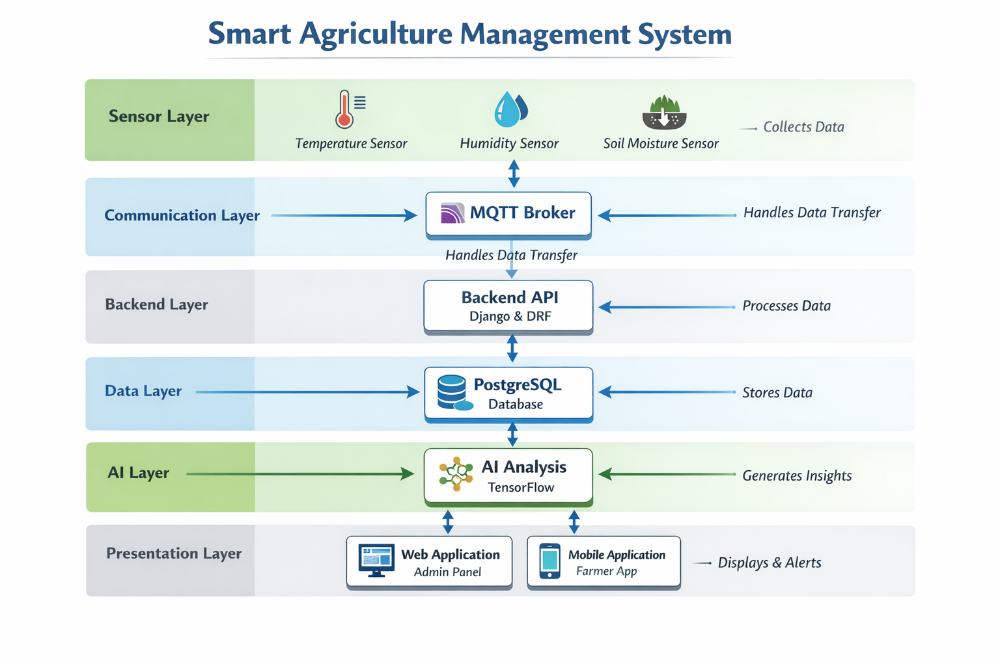

# 🌱 Akıllı Tarım Yönetim Sistemi

## 👥 Grup Üyeleri ve Görev Dağılımı
- **Ahmet Enes Altun** → Proje Mimari Tasarımı  
- **Hayat Ay** → Proje Analizi ve Kapsam Belirleme  
- **Sami Yusuf Yıldız** → Gereksinim Toplama ve Analizi  
- **Ebubekir Yılmaz** → Teknoloji Araştırması ve Seçimi  
- **Ceren Çam** → Geliştirme Ortamı Kurulumu  

---

# 📌 Proje Açıklaması

Bu proje, sensör verileri ve yapay zeka kullanarak tarım süreçlerini optimize etmeyi amaçlamaktadır.

Toprak nemi, sıcaklık ve hava durumu gibi veriler analiz edilerek sulama, gübreleme ve ilaçlama işlemleri daha verimli bir şekilde yönetilecektir.

Sistem, tarım alanından toplanan verileri analiz ederek çiftçilere doğru kararlar almalarında yardımcı olur. Böylece hem verimlilik artırılır hem de su ve gübre gibi kaynakların gereksiz kullanımı azaltılır.

---

# 🛠️ Kullanılan Teknolojiler

- Python  
- TensorFlow  
- IoT Sensörleri  
- Django  
- PostgreSQL  
- MQTT  

---

# 📦 Teslim Edilecek Modüller

- Sensör veri toplama modülü  
- Yapay zeka tabanlı analiz motoru  
- Web tabanlı yönetim paneli  
- Mobil uygulama  

---

# 🏗️ Proje Mimari Tasarımı (Ahmet Enes Altun)

## 📝 Genel Mimari

Akıllı Tarım Yönetim Sistemi, tarım alanına yerleştirilen IoT sensörlerinden veri toplayan, bu verileri analiz eden ve kullanıcıya web veya mobil uygulama üzerinden sunan bir sistemdir.

### Sistem çalışma akışı

- IoT sensörleri çevresel verileri toplar  
- Toplanan veriler Django API aracılığıyla sunucuya iletilir  
- Veriler PostgreSQL veritabanında saklanır  
- TensorFlow tabanlı yapay zeka modeli verileri analiz eder  
- Analiz sonuçları web paneli ve mobil uygulama üzerinden kullanıcıya sunulur  

---

## 🔧 Sistem Modülleri

- Sensör Veri Toplama Modülü  
- Veri İşleme ve Depolama Modülü  
- Yapay Zeka Analiz Modülü  
- Web Yönetim Paneli  
- Mobil Uygulama  

---

## 🧩 Bileşenler Arasındaki İlişki

IoT Sensörleri → Django API → PostgreSQL Veritabanı → TensorFlow Analiz Motoru → Web Paneli / Mobil Uygulama

Sensörlerden gelen veriler backend tarafından alınır, veritabanında saklanır ve yapay zeka motoru ile analiz edilerek kullanıcılara öneriler sunulur.

---

## 🏛️ Kullanılan Tasarım Desenleri

### Katmanlı Mimari (Layered Architecture)

Sistem aşağıdaki katmanlardan oluşmaktadır:

- Veri Katmanı  
- İş Mantığı Katmanı  
- Sunum Katmanı  

Bu yapı sayesinde sistem daha düzenli, sürdürülebilir ve geliştirilebilir hale gelir.

### MVT (Model-View-Template)

Django frameworkü backend geliştirilmesinde **MVT mimarisini** kullanır.

- **Model:** Veritabanı yapısını temsil eder  
- **View:** İş mantığını yönetir  
- **Template:** Kullanıcıya gösterilen arayüzü oluşturur  

---

## 📊 Mimari Diyagram

---

## ✅ Sonuç

Bu mimari yapı sayesinde sistem sensörlerden gelen verileri analiz ederek tarım süreçlerini optimize eder. Modüler yapı sayesinde sistemin geliştirilmesi ve ileride genişletilmesi kolaydır.

---

# 🏗️ Teknoloji Araştırması ve Seçim Gerekçeleri (Ebubekir Yılmaz)

## 1. Programlama Dili: Python

Projenin ana geliştirme dili olarak **Python 3.10+** seçilmiştir.

**Neden?**  
IoT cihazlarından veri çekme, TensorFlow ile yapay zeka modeli eğitme ve Django ile web sunucusu geliştirme süreçlerinin tamamını tek bir dil ekosisteminde birleştirmek mümkündür.

**Gerekçe:**  
Python geniş kütüphane desteğine sahiptir. Sensör verisi işleme için **Pandas**, matematiksel hesaplamalar için **NumPy** gibi güçlü araçlar sağlar.

---

## 2. Backend Framework: Django & Django REST Framework

Sistem mimarisinin web uygulama çatısı olarak **Django** tercih edilmiştir.

**Neden?**  
Kullanıcı yönetimi, admin paneli ve güvenli veritabanı erişimi gibi özellikleri hazır olarak sunar.

**Gerekçe:**  
Django REST Framework sayesinde sensör cihazları ve mobil uygulamalar için API geliştirmek kolaylaşır.

---

## 3. Veritabanı: PostgreSQL

Veri depolama birimi olarak **PostgreSQL** seçilmiştir.

**Neden?**  
Büyük veri setlerini güvenli ve performanslı şekilde yönetebilir.

**Gerekçe:**  
Sensörlerden gelen veriler düzenli şekilde saklanabilir ve analiz süreçlerinde kolayca kullanılabilir.

---

## 4. Yapay Zeka: TensorFlow

Analiz motoru için **TensorFlow** kullanılacaktır.

**Neden?**  
Makine öğrenmesi ve veri analizi için güçlü bir altyapı sunar.

**Gerekçe:**  
Sensör verileri kullanılarak sulama veya gübreleme önerileri üretilebilir.

---

## 5. IoT İletişim Protokolü: MQTT

Sensörler ile sunucu arasındaki veri iletişimi için **MQTT protokolü** kullanılacaktır.

**Neden?**  
Düşük bant genişliği kullanır ve IoT cihazları için optimize edilmiştir.

**Gerekçe:**  
Tarım alanlarında bulunan sensörlerin düşük enerji tüketimi ile veri göndermesini sağlar.

---

## 📊 Özet Karşılaştırma Tablosu

| Bileşen | Seçilen Araç | En Büyük Avantajı |
| :--- | :--- | :--- |
| **Dil** | Python 3.10+ | Ekosistem birliği (AI + Web + Scripting) |
| **Veri Analizi** | Pandas / NumPy | Sensör verilerini temizleme ve işleme hızı |
| **Haberleşme** | MQTT / WebSockets | Gerçek zamanlı veri akışı ve düşük enerji tüketimi |
| **Deployment** | Docker | Ortam bağımsız, hızlı ve hatasız kurulum |

## 📋 Proje Kapsam Belgesi (Hayat Ay)
##  1. Proje Tanımı:
Akıllı Tarım Yönetim Sistemi, tarım alanlarından IoT sensörleri aracılığıyla toplanan verileri analiz ederek
çiftçilere daha verimli ve sürdürülebilir tarım yönetimi sunmayı amaçlayan bir yazılım sistemidir. Sistem,
çevresel verileri toplayarak analiz eder ve kullanıcıya web veya mobil arayüz üzerinden anlamlı bilgiler sağlar.
Toplanan veriler merkezi bir sistemde saklanır ve yapay zeka destekli analizler ile değerlendirilir. Böylece kullanıcılar tarım faaliyetlerini daha bilinçli ve verimli şekilde yönetebilir.

##  2. Projenin Amacı
Bu projenin amacı, tarım alanlarında kullanılan sensörlerden elde edilen verileri dijital ortamda analiz ederek çiftçilere karar destek sistemi sunmaktır.
## Projenin temel hedefleri şunlardır:
* Tarımsal verilerin otomatik olarak toplanması
* Verilerin güvenli şekilde saklanması
* Yapay zeka algoritmaları ile analiz edilmesi
* Kullanıcıların web veya mobil arayüz üzerinden verilere erişebilmesi
* Tarımsal verimliliğin artırılması

## 3. Kullanılan Teknolojiler
## Projenin geliştirilmesinde aşağıdaki teknolojiler kullanılacaktır:
* Python: Sistem geliştirme ve veri işleme süreçlerinde ana programlama dili olarak kullanılacaktır.
* TensorFlow: Sensörlerden gelen verilerin analiz edilmesi ve tahmin modellerinin oluşturulması için kullanılacaktır.
* IoT Sensörleri: Tarım alanından sıcaklık, nem ve diğer çevresel verileri toplamak için kullanılacaktır.
* Django: Web tabanlı API ve yönetim panelinin geliştirilmesi için kullanılacaktır.
* PostgreSQL: Sensör verilerinin güvenli ve düzenli şekilde saklanması için veritabanı sistemi olarak kullanılacaktır.

## 4. Proje Kapsamı
## ✅ Kapsama Dahil Olan Özellikler
* IoT sensörlerinden veri toplanması
* Sensör verilerinin API aracılığıyla sisteme gönderilmesi
* Verilerin PostgreSQL veritabanında saklanması
* Python ve TensorFlow kullanılarak veri analizi yapılması
* Django tabanlı web arayüzü üzerinden verilerin görüntülenmesi
* Kullanıcıların sisteme giriş yapabilmesi
* Sistem yöneticisinin verileri yönetebilmesi

## ❌ Kapsama Dahil Olmayan Özellikler
* Sensör donanımının fiziksel üretimi
* Ağır tarım makinelerinin doğrudan kontrol edilmesi
* Ticari ölçekli büyük tarım işletmeleri için özel modüller

## 5. Proje Paydaşları
Paydaş                          Açıklama
* Çiftçiler	        |         Sistemi kullanarak tarım verilerini takip eder
* Sistem            |         Yöneticisi	Sistemi yönetir ve kontrol eder
* Yazılım Geliştiriciler	|   Sistemin geliştirilmesini sağlar
* Proje Ekibi            |   	Projenin planlanması ve uygulanmasından sorumludur

## 6. Sonuç
Akıllı Tarım Yönetim Sistemi, IoT sensörleri ve yapay zeka teknolojilerini bir araya getirerek tarım verilerinin daha verimli şekilde analiz edilmesini sağlamayı amaçlamaktadır. Bu sistem sayesinde çiftçiler çevresel verileri daha kolay takip edebilecek ve tarım süreçlerini daha verimli şekilde yönetebilecektir.

---

## ⚙️ Geliştirme Ortamı Kurulumu (Ceren Çam)

## Geliştirme Ortamı
Akıllı Tarım Yönetim Sistemi projesinin geliştirme sürecinde kullanılacak yazılım araçları ve bağımlılıklar belirlenmiş ve geliştirme ortamı yapılandırılmıştır. Bu ortam, ekip üyelerinin aynı teknolojileri kullanarak proje üzerinde çalışabilmesini sağlar.

## Kullanılan Geliştirme Araçları

## 1. IDE (Kod Geliştirme Ortamı)
Projenin geliştirilmesi için Visual Studio Code (VS Code) kullanılacaktır.

VS Code;
- Python geliştirme desteği sunar
- Git ile entegre çalışabilir
- Django projeleri için uygun bir geliştirme ortamı sağlar

## 2. Programlama Dili
Projenin geliştirilmesinde ana programlama dili olarak Python 3.10+ kullanılacaktır.

Python;
- sensör verilerinin işlenmesi
- yapay zeka modellerinin geliştirilmesi
- backend servislerinin oluşturulması

gibi işlemler için kullanılacaktır.

## 3. Backend Framework
Web tabanlı yönetim paneli ve API geliştirme süreçleri için Django frameworkü kullanılacaktır.
API geliştirme sürecinde ayrıca Django REST Framework (DRF) kullanılacaktır.

## 4. Yapay Zeka ve Veri Analizi Kütüphaneleri
Sensörlerden elde edilen verilerin analiz edilmesi için TensorFlow kullanılacaktır.
Veri işleme ve analiz süreçlerinde aşağıdaki Python kütüphaneleri kullanılacaktır:
- NumPy
- Pandas

Bu kütüphaneler sensör verilerinin işlenmesi ve analiz edilmesi için kullanılacaktır.

## 5. Veritabanı Sistemi
Projenin veri depolama sistemi olarak PostgreSQL veritabanı kullanılacaktır.

PostgreSQL;
- sensör verilerinin saklanması
- kullanıcı bilgilerinin tutulması
- analiz sonuçlarının depolanması

için kullanılacaktır.

## 6. IoT İletişim Protokolü
Tarım alanında bulunan sensörler ile sistem arasındaki veri iletişimi için MQTT protokolü kullanılacaktır.

MQTT;
- düşük enerji tüketimi
- hızlı veri iletimi
- IoT cihazları ile uyumlu yapı

gibi avantajlar sağlar.

## 7. Versiyon Kontrol Sistemi
Projenin kaynak kodlarının yönetilmesi için Git ve GitHub kullanılmaktadır.

Git;
- ekip üyelerinin aynı proje üzerinde birlikte çalışmasını sağlar
- yapılan değişikliklerin takip edilmesini sağlar
- proje sürümlerinin kontrol edilmesine yardımcı olur

Proje deposu GitHub üzerinde oluşturulmuş ve ekip üyeleri projeye dahil edilmiştir.

## 8. AI Destekli Geliştirme Araçları
Proje geliştirme sürecinde bazı modüllerin oluşturulması ve prototip geliştirme aşamalarında Antigravity AI aracı kullanılacaktır.

Antigravity;
- proje modüllerinin hızlı şekilde oluşturulması
- prototip geliştirme süreçlerinin hızlandırılması
- yazılım geliştirme sürecinin desteklenmesi

amacıyla kullanılmaktadır.

## 9. Container / Deployment Aracı

Projenin farklı sistemlerde çalıştırılabilmesi ve taşınabilirliğinin sağlanması için Docker kullanılacaktır.

Docker;
- uygulamanın farklı işletim sistemlerinde çalışması
- proje ortamını ekip üyeleri arasında standartlaştırması
- ileride deployment süreçlerini kolaylaştırması

amacıyla kullanılacaktır.

## Sonuç
Belirlenen geliştirme ortamı sayesinde ekip üyeleri aynı araçları kullanarak proje üzerinde çalışabilir. Bu ortam, yazılım geliştirme sürecinin düzenli ilerlemesini ve ekip içi iş birliğinin sağlanmasını kolaylaştırır.

---

## 📋 Gereksinim Toplama ve Analizi (Sami Yusuf Yıldız)

Yazılım projelerinde gereksinim toplama ve analiz aşaması, sistemin doğru şekilde tasarlanması ve geliştirilmesi için en önemli adımlardan biridir. Bu aşamada sistemin hangi ihtiyaçlara çözüm üreteceği, kullanıcıların sistemden beklentileri ve sistemin yerine getirmesi gereken işlevler detaylı bir şekilde incelenmiştir. Projenin bu bölümünde Akıllı Tarım Yönetim Sistemi için gerekli olan fonksiyonel ve fonksiyonel olmayan gereksinimler belirlenmiş ve analiz edilmiştir.

Gereksinim toplama sürecinde tarım sektöründeki temel ihtiyaçlar araştırılmış, özellikle çiftçilerin tarımsal verileri daha verimli kullanabilmesi için gerekli olan sistem özellikleri değerlendirilmiştir. IoT sensörlerinden elde edilen verilerin analiz edilmesi, saklanması ve kullanıcıya anlamlı bilgiler halinde sunulması projenin temel gereksinimleri arasında yer almaktadır. Ayrıca sistemin hem web hem de mobil platformlar üzerinden erişilebilir olması hedeflenmiştir.

## Fonksiyonel Gereksinimler

Fonksiyonel gereksinimler, sistemin kullanıcılar için yerine getirmesi gereken temel işlevleri ifade eder. Proje kapsamında belirlenen başlıca fonksiyonel gereksinimler şunlardır:

- Tarım alanlarına yerleştirilen IoT sensörleri aracılığıyla sıcaklık, nem ve toprak verilerinin toplanması
- Sensörlerden elde edilen verilerin sistem sunucusuna gönderilmesi
- Toplanan verilerin PostgreSQL veritabanında güvenli şekilde saklanması
- Yapay zeka algoritmaları kullanılarak sensör verilerinin analiz edilmesi
- Analiz sonuçlarının kullanıcıya web paneli veya mobil uygulama aracılığıyla sunulması
- Kullanıcıların sisteme güvenli bir şekilde giriş yapabilmesi ve kendi verilerini görüntüleyebilmesi

## Fonksiyonel Olmayan Gereksinimler

Fonksiyonel olmayan gereksinimler, sistemin performans, güvenlik ve kullanılabilirlik gibi özelliklerini tanımlar. Proje kapsamında belirlenen başlıca fonksiyonel olmayan gereksinimler şunlardır:

- Sistem sensör verilerini hızlı ve güvenilir bir şekilde işleyebilmelidir
- Kullanıcı ve sensör verileri güvenli bir veritabanında saklanmalıdır
- Sistem farklı cihazlar ve platformlar üzerinden erişilebilir olmalıdır
- Sistem modüler bir yapıda tasarlanmalı ve ileride geliştirilebilir olmalıdır
- Veri aktarımı sırasında veri bütünlüğü korunmalıdır
## 📖 User Stories

### User Story 1
**Rol:** Çiftçi  
**İstek:** Tarlamdaki toprak nemi ve sıcaklık verilerini sistem üzerinden görmek istiyorum.  
**Sebep:** Böylece bitkilerimin mevcut durumunu takip edebilirim.

---

### User Story 2
**Rol:** Çiftçi  
**İstek:** Sensörlerden gelen verilerin yapay zeka tarafından analiz edilmesini istiyorum.  
**Sebep:** Böylece sulama ve gübreleme zamanlarını daha doğru planlayabilirim.

---

### User Story 3
**Rol:** Çiftçi  
**İstek:** Mobil uygulama üzerinden tarlamdaki verileri anlık olarak görüntülemek istiyorum.  
**Sebep:** Böylece bulunduğum yerden bağımsız olarak tarım alanımı kontrol edebilirim.

---

### User Story 4
**Rol:** Kullanıcı  
**İstek:** Sisteme güvenli bir şekilde giriş yapmak istiyorum.  
**Sebep:** Böylece yalnızca bana ait tarım verilerine erişebilirim.

---

### User Story 5
**Rol:** Çiftçi  
**İstek:** Sistemden analiz sonuçlarına göre öneriler almak istiyorum.  
**Sebep:** Böylece su, gübre ve ilaç kullanımını daha verimli şekilde yönetebilirim.

---

### User Story 6
**Rol:** Yönetici  
**İstek:** Sensör verilerinin veritabanında güvenli şekilde saklanmasını istiyorum.  
**Sebep:** Böylece geçmiş verileri inceleyebilir ve analiz yapabilirim.

---

### User Story 7
**Rol:** Kullanıcı  
**İstek:** Sisteme hem web hem de mobil cihazlardan erişebilmek istiyorum.  
**Sebep:** Böylece istediğim yerden sistem verilerine ulaşabilirim.
## Sonuç

Gereksinim toplama ve analiz süreci sayesinde sistemin gerçekleştirmesi gereken işlevler ve teknik ihtiyaçlar net bir şekilde belirlenmiştir. Bu aşama, projenin sonraki geliştirme süreçleri için sağlam bir temel oluşturmuş ve sistem mimarisinin daha planlı bir şekilde tasarlanmasına katkı sağlamıştır. Doğru bir gereksinim analizi yapılması, projenin hedeflerine ulaşması ve kullanıcı ihtiyaçlarının karşılanması açısından büyük önem taşımaktadır.

---

## 📄  Detaylı Gereksinim Belgesi (Hayat Ay)

 ## 👤 1. Kullanıcı Hikayeleri
 ## User Story 1

- Rol: Çiftçi
- İstek: Tarlamdaki toprak nemi ve sıcaklık verilerini sistem üzerinden görmek istiyorum.
- Sebep: Böylece bitkilerimin mevcut durumunu takip edebilirim.

## User Story 2

- Rol: Çiftçi
- İstek: Sensörlerden gelen verilerin yapay zeka tarafından analiz edilmesini istiyorum.
- Sebep: Böylece sulama ve gübreleme zamanlarını daha doğru planlayabilirim.

## User Story 3

- Rol: Çiftçi
- İstek: Mobil uygulama üzerinden tarlamdaki verileri anlık olarak görüntülemek istiyorum.
- Sebep: Böylece bulunduğum yerden bağımsız olarak tarım alanımı kontrol edebilirim.

## User Story 4

- Rol: Kullanıcı
- İstek: Sisteme güvenli bir şekilde giriş yapmak istiyorum.
- Sebep: Böylece yalnızca bana ait tarım verilerine erişebilirim.

## User Story 5

- Rol: Çiftçi
- İstek: Sistemden analiz sonuçlarına göre öneriler almak istiyorum.
- Sebep: Böylece su, gübre ve ilaç kullanımını daha verimli şekilde yönetebilirim.

## User Story 6

- Rol: Yönetici
- İstek: Sensör verilerinin veritabanında güvenli şekilde saklanmasını istiyorum.
- Sebep: Böylece geçmiş verileri inceleyebilir ve analiz yapabilirim.

## User Story 7

- Rol: Kullanıcı
- İstek: Sisteme hem web hem de mobil cihazlardan erişebilmek istiyorum.
- Sebep: Böylece istediğim yerden sistem verilerine ulaşabilirim.

## 🎬 2.Kullanım Senaryoları (Use Case)
 ## Senaryo 1 – Sensör Verilerini Görüntüleme
- Aktör: Çiftçi
-Adımlar:
-Kullanıcı sisteme giriş yapar.
-Sistem kullanıcı bilgilerini doğrular.
-IoT sensörlerinden gelen veriler veritabanından alınır.
-Veriler kullanıcı arayüzünde gösterilir.

-Sonuç:
Kullanıcı tarlasındaki güncel durumu görüntüler.

## Senaryo 2 – Yapay Zeka ile Veri Analizi
- Aktör: Sistem
- Adımlar:
- Sensörlerden veri toplanır.
- Veriler sistemde işlenir.
- Python ve TensorFlow kullanılarak analiz yapılır.
- Analiz sonuçları veritabanına kaydedilir.

- Sonuç:
Sistem tarımsal kararlar için analiz sonuçları üretir.

## Senaryo 3 – Mobil Erişim
- Aktör: Çiftçi
- Adımlar:
- Kullanıcı mobil uygulamayı açar.
- Kullanıcı sisteme giriş yapar.
- Sensör verileri görüntülenir.

- Sonuç:
Kullanıcı bulunduğu yerden bağımsız olarak sisteme erişir.

## Senaryo 4 – Güvenli Giriş
- Aktör: Kullanıcı
- Adımlar:
- Kullanıcı kullanıcı adı ve şifre girer.
- Sistem kimlik doğrulaması yapar.
- Kullanıcı sisteme giriş yapar.

- Sonuç:
Yetkili erişim sağlanır.

## Senaryo 5 – Öneri Sistemi
- Aktör: Sistem
- Adımlar:
- Sensör verileri analiz edilir.
- Sistem sulama veya gübreleme önerileri oluşturur.
- Kullanıcıya öneriler gösterilir.

- Sonuç:
Kullanıcı doğru tarım kararları alır.

## Senaryo 6 – Veri Yönetimi 
- Aktör: Yönetici
- Adımlar:
- Yönetici sisteme giriş yapar
- Sistem veritabanına erişim sağlar
- Yönetici sensör verilerini görüntüler veya kontrol eder
- Gerekirse veri düzenleme veya silme işlemi yapar

-Sonuç:
Veriler güvenli ve düzenli şekilde yönetilir

## 3. Fonksiyonel Gereksinimler

- IoT sensörlerinden veri toplamalıdır.
- Toplanan verileri PostgreSQL veritabanında saklamalıdır.
- Python ile veri işleme yapmalıdır.
- TensorFlow ile veri analizi gerçekleştirmelidir.
- Django framework kullanılarak web arayüzü sunmalıdır.
- Kullanıcı giriş ve kimlik doğrulama sistemi içermelidir.
- Mobil ve web platformlarını desteklemelidir.
- Kullanıcıya analiz sonuçlarını göstermelidir.
- Kullanıcıya öneri sistemi sunmalıdır.

## 4. Fonksiyonel Olmayan Gereksinimler
- Sistem güvenli olmalıdır.
- Sistem hızlı çalışmalıdır.
- Sistem kullanıcı dostu bir arayüze sahip olmalıdır.
- Sistem farklı cihazlarda sorunsuz çalışmalıdır.
- Sistem yüksek veri doğruluğu sağlamalıdır.
- Sistem ölçeklenebilir olmalıdır.

## 👥5. Paydaşlar
- Çiftçiler (Sistemin ana kullanıcıları)
- Sistem yöneticileri
- Yazılım geliştirme ekibi
- Proje yöneticisi

## 6. Paydaş Onayı ve Önceliklendirme

- Toplanan gereksinimler proje paydaşları ile paylaşılmış ve değerlendirilmiştir. Yapılan toplantılar ve değerlendirmeler sonucunda gereksinimler onaylanmış ve önceliklendirilmiştir.

## Yüksek Öncelik:
- Sensör verilerinin toplanması
- Sensör verilerinin görüntülenmesi
- Yapay zeka ile veri analizi
- Güvenli kullanıcı girişi
- Veri güvenliği

## Orta Öncelik:
- Mobil uygulama erişimi
- Öneri sistemi
- Kullanıcı deneyimi

## Düşük Öncelik:
- Ek raporlama özellikleri
- Gelişmiş analiz araçları

Bu önceliklendirme, sistem geliştirme sürecinin planlanmasında kullanılacaktır.

## 7. Sonuç
- Bu gereksinim belgesi, Akıllı Tarım Yönetim Sistemi için kullanıcı ihtiyaçlarını, sistem gereksinimlerini ve kullanım senaryolarını detaylı şekilde tanımlamaktadır. Bu belge proje geliştirme sürecinde referans doküman olarak kullanılacaktır.

---

## 🏗️ Detaylı Mimari Tasarım (Ceren Çam)

## Genel Bakış

Bu bölümde, Akıllı Tarım Yönetim Sistemi'nin genel mimarisi daha detaylı şekilde ele alınmış ve sistem bileşenleri arasındaki ilişkiler teknik olarak açıklanmıştır.

Bu tasarım, sistemin ölçeklenebilir, sürdürülebilir ve modüler bir yapıda geliştirilmesini hedeflemektedir.

## Katmanlı Mimari Yapı

Sistem, üç ana katmandan oluşmaktadır:

### 1. Veri Katmanı (Data Layer)
- PostgreSQL veritabanı kullanılmaktadır  
- Sensör verileri, kullanıcı bilgileri ve analiz sonuçları burada saklanır  
- Veriler düzenli ve güvenli şekilde depolanır  

### 2. İş Mantığı Katmanı (Business Logic Layer)
- Django ve Django REST Framework kullanılarak geliştirilir  
- API servisleri bu katmanda yer alır  
- Sensör verileri işlenir ve yapay zeka modeline gönderilir  
- TensorFlow ile analiz işlemleri gerçekleştirilir  

### 3. Sunum Katmanı (Presentation Layer)
- Web arayüzü ve mobil uygulama bu katmanda yer alır  
- Kullanıcılar verileri görüntüler ve sistemle etkileşime geçer  
- Kullanıcı dostu arayüzler sayesinde sistem kolay kullanılabilir  

## Veri Akışı

Sistem içerisindeki veri akışı aşağıdaki gibidir:

IoT Sensörleri → MQTT Broker → Django API → PostgreSQL → TensorFlow → Django API → Web / Mobil Arayüz

- Sensörler veriyi toplar  
- MQTT ile sunucuya iletilir  
- Django API veriyi alır ve veritabanına kaydeder  
- Yapay zeka modeli veriyi analiz eder  
- Sonuçlar kullanıcıya sunulur  

## Bileşenler Arası İletişim

Sistem bileşenleri arasında iletişim aşağıdaki şekilde sağlanmaktadır:

- IoT sensörleri, MQTT protokolü ile veri gönderir  
- MQTT Broker, veriyi backend sistemine iletir  
- Django API, gelen verileri işler ve veritabanına kaydeder  
- TensorFlow modeli, verileri analiz ederek sonuç üretir  
- Web ve mobil uygulamalar, API üzerinden bu verilere erişir  

## Sistem Bileşenleri Detayı

### Sensör Katmanı
- Tarım alanından veri toplar  
- Sıcaklık, nem ve toprak bilgilerini üretir  

### API Katmanı
- Sensörlerden gelen verileri karşılar  
- Verileri işler ve saklar  
- Mobil ve web uygulamalarına veri sağlar  

### Yapay Zeka Katmanı
- TensorFlow ile geliştirilmiştir  
- Sensör verilerini analiz eder  
- Kullanıcıya öneriler üretir  

### Kullanıcı Arayüzü
- Web paneli ve mobil uygulamadan oluşur  
- Kullanıcılar verileri görüntüler ve takip eder  

## Mimari Yaklaşım

Sistem tasarımında katmanlı mimari yapısı benimsenmiştir. Bu sayede:

- Sistem modüler hale gelir  
- Bakım ve geliştirme kolaylaşır  
- Farklı bileşenler bağımsız şekilde geliştirilebilir  

## Mimari Diyagram

Diyagram, sistem bileşenleri arasındaki veri akışını görsel olarak temsil etmektedir.

## Sonuç

Detaylı mimari tasarım sayesinde sistemin tüm bileşenleri ve veri akışı net bir şekilde tanımlanmıştır. Bu yapı, sistemin sürdürülebilir ve ölçeklenebilir bir şekilde geliştirilmesine olanak sağlar.

---

# 🛠️ Teknik Uygulama ve API Tasarımı (Ebubekir Yılmaz)

Projenin backend altyapısı ve sensör veri akışını simüle eden merkezi API sistemi kurulmuştur. Bu yapı, fiziksel donanım aşamasına kadar sistemin tüm fonksiyonlarını test etmeye olanak sağlar.

## 📡 1. API Endpoint Tasarımı
Sistem bileşenleri (IoT, Web, Mobil) arasındaki iletişim RESTful standartlarına uygun olarak tasarlanmıştır.

| Metot | Endpoint | Açıklama | Yetki |
| :--- | :--- | :--- | :--- |
| **POST** | `/api/sensor-data/` | Sensörden gelen anlık verileri (sıcaklık, nem vb.) kaydeder ve karar üretir. | IoT Device |
| **GET** | `/admin/` | Veritabanındaki tüm geçmiş sensör verilerini ve sistem kararlarını listeleyen panel. | Yönetici |

## 🚜 2. Akıllı Tarım Simülasyonu
Fiziksel sensörlerin (ESP32/Arduino) yerini alan bir `simulator.py` modülü geliştirilmiştir.

* **Çalışma Mantığı:** Gerçek bir tarladaki çevresel değişimleri simüle ederek rastgele ancak fiziksel limitler dahilinde veri üretir.
* **Karar Mekanizması:** Sistem, gelen toprak nemi verisini anlık analiz eder. Nem **%30'un** altına düştüğünde otomatik olarak "SULAMA SİSTEMİ BAŞLATILDI" komutunu üretir.

## ⚙️ 3. Kurulum ve Çalıştırma Talimatları
Projeyi yerel ortamda ayağa kaldırmak için aşağıdaki adımlar izlenmelidir:

1. **Gereksinimler:** `pip install -r requirements.txt` komutuyla gerekli kütüphaneleri kurun.
2. **Veritabanı:** `python manage.py migrate` komutuyla veritabanı tablolarını oluşturun.
3. **Sunucu:** `python manage.py runserver` ile Django sunucusunu başlatın.
4. **Simülatör:** Yeni bir terminalde `python simulator.py` komutuyla veri akışını başlatın.
